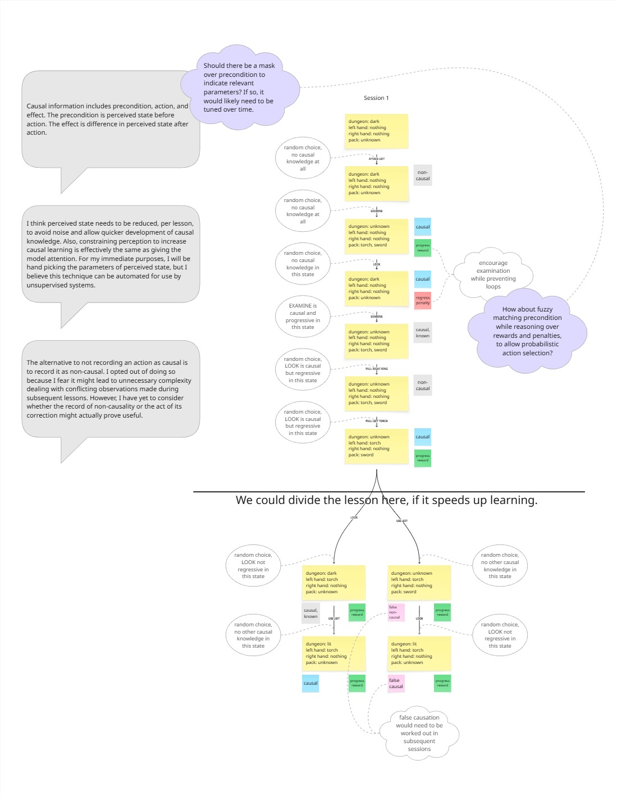

# Knowledge Representation

_How the agent holds two kinds of knowledge — experience and expectation — and how it uses them together to reason. This is an open discussion, not a plan. It follows [`knowledge-and-reasoning.md`](knowledge-and-reasoning.md), which argues why knowledge should live outside the weights; this doc describes the shape that knowledge takes, and the parts still undecided. It keeps the exchanges that produced it, not just the conclusions._

## What are the two kinds of knowledge?

The framing that started this discussion came first:

> **the premise** — "Each step executes an action against a given game state and returns a resulting state. If we capture those transitions over a session, we could consider memory of them experiential knowledge. My intention is to later pair this with a secondary set of data representing the agent's causal knowledge — to iterate over both in conjunction, and generate predictions as a means of reasoning."
>
> **the answer** — "The point of holding both is to read them together: place the situation the agent faces against the distilled causes, let the remembered moments confirm or contradict them, and predict what an action will do before committing to it. That pairing is what this project means by reasoning."

The agent ends up with two sets of knowledge, and they are different things:

- **Experience** is the record of what happened. Each entry is one moment: where things stood, what the agent did, and what changed as a result.
- **Expectation** is the summary of what causes what, drawn from many moments. Experience says "in this situation, pulling put the torch in my hand." Expectation says "pulling moves the torch from the pack to the hand."

Experience by itself is just a recording. Expectation by itself is a claim with nothing behind it. The representation holds both side by side so the agent can compare the situation it faces with what it has learned causes what, and let the recorded moments confirm or contradict that. Predicting before acting — that is what this project calls **reasoning**.

This is the same split `knowledge-and-reasoning.md` draws between **memory** (true for one run) and **knowledge** (true across runs). Experience is the accumulated moments; expectation is the summary; and consolidation is the step that turns one into the other.

## What does experience look like?



The request came in with the figure still taking shape, wanting the idea pushed further than the drawing carried it. It was hard to tell what had landed and what had not. The reply found the cause: three separate layers pressed into one view, which is what makes it confusing.

> **the request** — "Please have a look at this image and tell me what you think. It needs to be completed. There are implied rules and mechanics not made explicit yet. The overall concept needs a better introduction, considerate to a wide variety of readers."
>
> **the diagnosis** — "The figure puts three different things on one canvas and never says which is which — data, process, and judgment. A reader sees a box, an arrow, and three colored pills, and cannot tell that the pills answer three unrelated questions."

Pulled apart, the three layers are:

| Layer | What it is | In the figure |
|---|---|---|
| Representation | the data: situations, actions, effects, masks and values | the boxes and arrows |
| Capture | how the data gets made: runs, lessons, waiting for the game to settle, how the next action is chosen | the ellipses and the "divide the lesson here" rule |
| Valuation | the agent's judgment: causal or not, progress or setback, reward or penalty | the pills |

They describe the same object but answer different questions. The `causal` / `non-causal` label, for example, is a field on an arrow (data), but its value is decided during capture.

That overload had an obvious remedy:

> **the proposal** — "Each layer wants its own figure — three views of the same graph, not one overloaded diagram."
>
> **the agreement** — "We should probably create a different figure for each layer, yes?"

The first of the three is the data itself. A run of play looks like a graph. Each node is one situation the agent saw. Each arrow is an action taken from that node, along with what changed. Over a run the arrows trace the path the agent walked, and where more than one action was possible, the path branches.

The extent of that graph was settled early:

> **the definition** — "One session, in my mind, is from the start of the game to victory or death. In the graph, that's from the initial node to the terminal node."

The basic unit has three parts:

- the **situation** (also called the precondition) — what the agent sees before acting;
- the **action** — one command;
- the **effect** — what changed: which facts are different afterward, and how.

An effect is not something to detect on its own. It is the difference between two situations, read as a sparse vector over the facts. The vector's **mask** is the set of facts that changed; its **values** are how each changed (up or down, by how much). An expectation stores both the mask and the values. The mask is the expectation's structure, the facts it touches; the values are its content, what it does to them.

A situation is not the whole picture either. It is a sparse vector whose **situation mask** selects the facts that identify it, and whose values are what those facts currently are. Take a fact list of five: torch location (0 pack, 1 hand, 2 floor), torch lit (0 unlit, 1 lit), effective light (0–255), player X, player Y, with 255 the sentinel for "not selected":

```
situation: torch in pack   [0,   255, 255, 255, 255]   mask {0}, values [0]
situation: torch in hand   [1,   255, 255, 255, 255]   mask {0}, values [1]
effect:    PULL           [1,   255, 255, 255, 255]   mask {0}, values [1]
effect:    USE            [255, 1,   7,   255, 255]   mask {1,2}, values [1, 7]
```

The two situations share a mask and differ in values; the mask names what identifies the situation, and the values say which one it is. One full record bundles a situation vector, an action, an effect vector, and a judgment:

```
situation   [0,   255, 255, 255, 255]   torch in pack
action      PULL TORCH
effect      [1,   255, 255, 255, 255]   torch now in hand
judgment    causal, +0.1
```

An action leaves behind a fact, and it took an exchange to see that there are two kinds:

> **the claim** — "There are two kinds of fluent that an edge can write — `known` (EXAMINE writes what the agent has seen) versus game facts (PULL and USE write the torch's location and light). They compose differently: action links compose by a shared variable, while perception links compose only through reasoning."
>
> **the confusion** — "I'm not sure what you mean."
>
> **the explanation** — "An action leaves a fact behind, and there are two kinds. A *world fact* is something that changed in the game — pulling the torch moves it from the pack to the hand — written by actions like PULL and USE. Those connect directly: one action writes the fact, and the next reads it. A *knowledge fact* is something the agent now knows — that the pack holds a torch — written by actions that reveal, like EXAMINE, or by sight. Those do not connect directly; they connect through reasoning, because the agent acts on what it has learned."

In the figure, the `known` label marks the second kind.

## A lesson's scope

The full picture is noisy. The heart beats, the torch burns down, tiredness climbs, and most of that has nothing to do with the lesson being learned. So a lesson's scope names the facts it cares about, and every other fact is dropped before two situations are compared. The comparison then reports only what the scope includes.

The reasoning was stated plainly:

> **the reduction** — "I think the perceived state needs to be reduced, per lesson, to avoid noise and allow quicker development of causal knowledge. Constraining perception this way is effectively the same as giving the model attention. For my immediate purposes I will hand-pick the parameters, but I believe the technique can be automated."
>
> **the consequence** — "One consequence of doing things this way is that we will have to conceive a solution for combining knowledge from lessons, such that the resulting knowledge is in terms of the full field set."

The combination is not simple, because a lesson ignores some facts on purpose, and an ignored fact may have been hiding a real influence. So the pieces must be combined carefully, and the result must stay open to revision. Two scopes overlap when they share a fact:

```
torch lesson scope   [1, 1, 1, 0, 0]   facts {0,1,2}
sight lesson scope   [0, 0, 1, 1, 1]   facts {2,3,4}
overlap              [0, 0, 1, 0, 0]   fact {2}: effective light
```

Both lessons learned edges keyed to fact 2, so merging them must reconcile what each claims about effective light. (`knowledge-and-reasoning.md` leaves the same problem open, under "unifying overlapping masks.")

## When is one step finished?

Each step is a situation, an action, and the effect of that action. For the effect to mean anything, it has to belong to the action that caused it — so before any of this can work, one question has to be answered: **what counts as one step?** A command has three separate moments, and they are easy to confuse:

- **matched** — the game's parser recognizes the command;
- **executed** — the command's code runs;
- **changed** — the game state actually differs because of it.

Only the first leaves a mark we can read.

The exchange that produced this is worth keeping:

> **the discovery** — "Whoa — I didn't realize we were stepping until settled. I was wondering why checkpoints capture so many steps. It doesn't seem right to me."
>
> **the finding** — "Reading the code showed the opposite: the `step()` call sends a command and takes the very next record, and the wait-for-settle is an unimplemented follow-up. The many steps come from change-gating — every frame the state differs produces a record, and the heart, the torch timer, and tiredness differ often."
>
> **the insight** — "Nothing in memory says the handler ran, and nothing says the change was caused by the command. That last one has no sensor at all — it is the very inference the agent is supposed to make, so a ready-made signal would give the answer away."
>
> **the doubt** — "We need a signal that tells us the moment a command has been executed and the state has changed because of it. I don't know if `perfectMatch` is such a signal. The `command_text` echo seems more probable, assuming the command doesn't execute before the whole line has gone through the window. I think we have to sandbox this and try a variety of commands, not just the torch — the only reason a human can tell so easily is prior world knowledge and reasonable expectation."
>
> **the proposal** — "What if we decouple the action from the effect and let the agent pause further actions while it waits for a 'reasonable' effect? I can see where we'd want to record several state changes inside an allotted time slot, and block further actions at least while the agent's confidence about causation is low."
>
> **the synthesis** — "The world never goes fully quiet, so the window can't wait for the whole state to stop changing. But the lesson's own reduced facts can. Close the window once those facts hold still for a few frames — the reduction then does double duty: it quiets the noise and says when to stop waiting."

`perfectMatch` and `command_text` in that exchange have since been renamed in the schema: `command_parser_matched_exactly` and `command_area_text`.

So the approach is to **separate the action from its effect and wait out a window**: issue one action, block further actions, watch what changes during the window, then close it and record the effect. While the agent is unsure whether a cause is real, the window can stay open longer; as its confidence grows, it can shorten. A window that changes length makes the reward's time discount harder to reason about, so a fixed-length window is simpler.

The sandbox at [`../../sandbox/command-latency/`](../../sandbox/command-latency/README.md) is measuring these three moments. This doc lays out the question; the sandbox is where the answer comes from.

The three moments and the no-action control are the two halves of one need — causal attribution — named in [`causal-attribution.md`](causal-attribution.md).

## What marks a command finished?

The sandbox found the signal: `command_parser_position` (0x0211) snaps back to 0x02F1 once a command has run, and paired with the `???` the game prints (`command_rejected`) it tells executed from rejected. The finding is recorded in [`../findings/command-latency.md`](../findings/command-latency.md). What remains open is only where the wait lives — the environment's step, a wrapper, or a plugin record.

## How do experience and expectation meet?

The two datasets are used together in two passes, at two different times:

- **Consolidation** happens offline. It reads the accumulated experience and distills the clean expectations from it.
- **Execution** happens live. It matches the situation at hand against those expectations, then picks an action.

The match does not have to be exact. A loose match, weighted by how well the remembered moments turned out, lets the agent choose probabilistically rather than all-or-nothing. The full bridge is not buildable yet — the expectation side is still being worked out — but the experience side can be built ready for it. It needs to record the reduced situation, the action, the effect vector, and how the outcome was judged. Those are exactly what consolidation will sort through and what execution will match against.

## Vocabulary

- **Situation** — a sparse vector: the situation mask selects the facts that identify it, and the values are what those facts are. Never the game's hidden truth.
- **Action** — one command.
- **Effect** — a sparse vector: the effect mask selects the facts that changed, and the values are how each changed.
- **Mask** — the set of facts a vector selects.
- **Scope** — a lesson's subset of the fact list.
- **Transition** — a situation, an action, and an effect, recorded as one unit.
- **Session** — one playthrough of the game, from the start to the end (a win or a death).
- **Lesson** — one unit of the curriculum: a single goal and a single scope.
- **Expectation** — a transition generalized from many instances: this action, from this kind of situation, produces this kind of effect.

## Open questions

- **The settle signal.** Settled — see "What marks a command finished?" above.
- **Combining lessons.** How should the knowledge from different lessons be combined into one full picture without dragging in each lesson's blind spots?
- **The no-action control.** The world changes on its own. How is that background change captured, and what about the facts the agent does control?
- **False causation.** A link may be labeled causal and later turn out wrong. How is that caught and corrected, across sessions?
- **The bridge.** What exactly does execution match on, and how does a loose match weigh a cause by how it turned out before?
- **Confidence.** How is confidence in a cause measured (how often seen, how consistent?), and should it control the window's length?

## Reference

| Document | What it contains |
|---|---|
| [`knowledge-and-reasoning.md`](knowledge-and-reasoning.md) | The theory — why knowledge lives outside the weights |
| [`curriculum.md`](curriculum.md) | The lesson ordering and the per-lesson rewards the valuation layer feeds |
| [`../../sandbox/command-latency/`](../../sandbox/command-latency/README.md) | The experiment measuring the three moments |
| [`../../sandbox/causal-diff/`](../../sandbox/causal-diff/README.md) | The probe computing the effect diff |
| [`../2_plans/knowledge-store.md`](../2_plans/knowledge-store.md) | The storage spec: the data model and the storage choice |
